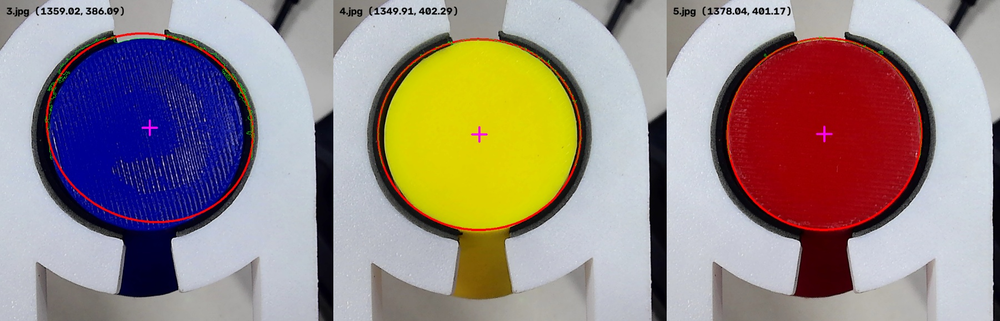

# 2026-10-07 抓取参考点测量

原图：`../../picture/3.jpg`、`4.jpg`、`5.jpg`，均为 2560×1440。
测量对象为夹持物料的黄色顶部圆面；假定物料在夹具中已经居中。
照片不能独立证明圆面中心与机械抓取轴完全重合。

| 照片 | 圆面中心 x | 圆面中心 y | 圆弧拟合 RMS（像素） |
| --- | ---: | ---: | ---: |
| 3.jpg | 1359.02 | 386.09 | 6.28 |
| 4.jpg | 1349.91 | 402.29 | 1.73 |
| 5.jpg | 1378.04 | 401.17 | 2.17 |

原图平均中心 `(1362.32, 396.52)`，样本标准差约 `(14.35, 9.05)` 像素。
这是三帧重复性，不是实际抓取精度保证。

方法：在夹持圆面区域分割黄色，排除底部与黄色侧壁相连的圆弧，
使用 OpenCV 椭圆拟合顶部和左右清晰轮廓。调整饱和度阈值后，
各照片中心变化不超过 0.60 原图像素。红线为拟合椭圆，绿色为采用的
轮廓，洋红色十字为测得中心。

## 写入程序的坐标

[MaixPy 相机文档](https://wiki.sipeed.com/maixpy/doc/zh/vision/camera.html)
说明宽高比不同时一般居中裁剪。按默认采集方式，将原图左右各裁掉
320 像素，1920×1440 缩放至 640×480：

`x = (1362.32 - 320) / 3 = 347.44`

`y = 396.52 / 3 = 132.17`

配置为 `(347.4, 132.2)`。此前的补边映射没有依据，已移除。
这仍以照片和运行画面使用同一传感器视野、方向、默认居中裁剪为前提；
若存在镜像、旋转、自定义裁剪或不同传感器模式，必须用实际 640×480 帧复核。
拍照来源和运行视野尚未得到实机确认，不能仅凭这三张照片保证坐标映射。

上机后在相同观察姿态和高度夹持物料，确认洋红色十字落在顶部圆面中心。
不同高度的物料顶面和地面靶环可能存在视差，需分别检查放置/抓取误差。
数据包继续使用 `dx = x - 359.3`、`dy = y - 132.1`，单位为像素。

复现：在 PC 目录运行 `python -B calibrate_grasp_photos.py`，依赖 numpy 和 opencv-python。
详细数值、照片 SHA256 见 `measurement.json`。测量脚本和图片无需上传 MaixCAM。
